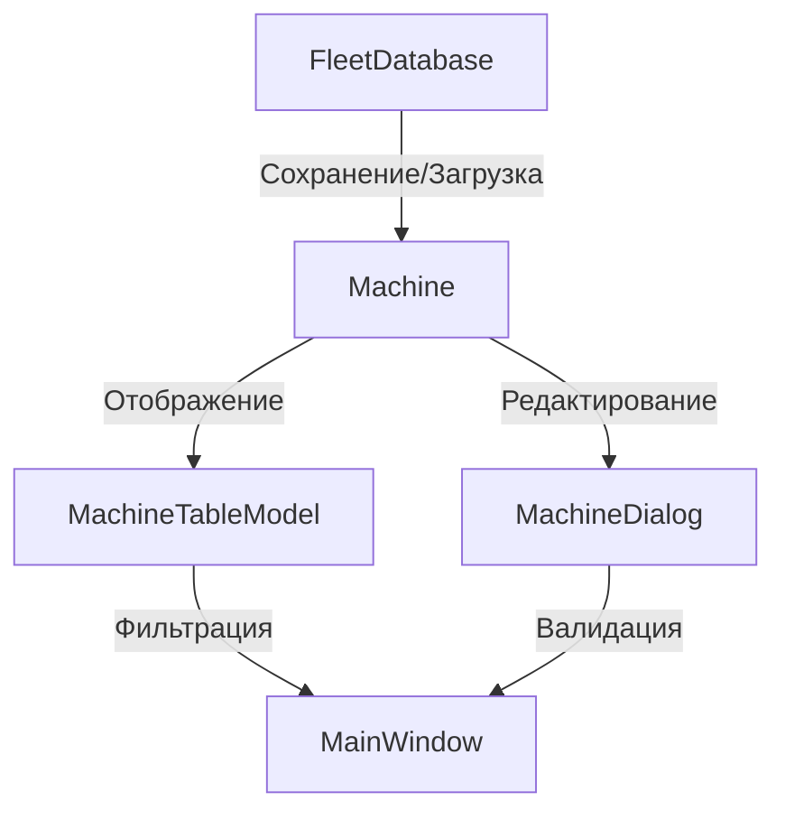

# Анализ модели данных и их отображения в FleetManager

## 1. Структура модели данных

### 1.1. Таблица `machines` в базе данных

В файле [`FleetDatabase.cpp`](src/database/FleetDatabase.cpp) определена структура таблицы `machines`, которая хранит информацию о технике:

```sql
CREATE TABLE IF NOT EXISTS machines (
    id INTEGER PRIMARY KEY AUTOINCREMENT,
    name TEXT NOT NULL,
    type TEXT NOT NULL,
    serial_number TEXT UNIQUE NOT NULL,
    year_of_manufacture INTEGER NOT NULL,
    status TEXT NOT NULL,
    cost REAL NOT NULL,
    currency TEXT NOT NULL DEFAULT 'RUB',
    current_project TEXT,
    assigned_date TEXT
)
```

**Поля таблицы:**
- `id`: Уникальный идентификатор записи
- `name`: Название техники (например, "Экскаватор CAT 320D")
- `type`: Тип техники (Экскаватор, Кран, Бульдозер и т.д.)
- `serial_number`: Серийный номер (уникальный, например, "CAT320D-2019-0847")
- `year_of_manufacture`: Год выпуска
- `status`: Текущий статус (Available, OnSite, InRepair, Decommissioned)
- `cost`: Стоимость
- `currency`: Валюта (по умолчанию RUB)
- `current_project`: Текущий проект (если назначена)
- `assigned_date`: Дата назначения на проект

### 1.2. Класс Machine

Класс [`Machine`](src/models/Machine.h) представляет единицу техники и содержит следующие свойства:

```cpp
class Machine {
    int m_id;                           // ID в базе данных
    QString m_name;                      // Название
    QString m_type;                      // Тип
    QString m_serialNumber;              // Серийный номер
    int m_yearOfManufacture;            // Год выпуска
    MachineStatus m_status;             // Текущий статус
    Money m_cost;                       // Стоимость
    QString m_currentProject;            // Текущий проект
    QDate m_assignedDate;               // Дата назначения на проект
};
```

**Статусы техники (MachineStatus):**
- `Available`: Свободна
- `OnSite`: На объекте
- `InRepair`: В ремонте
- `Decommissioned`: Списана

## 2. Хранение данных

### 2.1. Инициализация базы данных

База данных инициализируется в методе `initialize()` класса `FleetDatabase`:
- Создаются таблицы `machines`, `projects` и `currency_rates`
- Устанавливаются курсы валют по умолчанию (USD/RUB и RUB/USD)
- При необходимости создаются тестовые данные

### 2.2. Операции с техникой

Основные операции с техникой реализованы в [`FleetDatabase.cpp`](src/database/FleetDatabase.cpp):

- **Добавление техники**: `addMachine()`
- **Обновление техники**: `updateMachine()`
- **Удаление техники**: `deleteMachine()`
- **Получение всех машин**: `getAllMachines()`
- **Получение машины по ID**: `getMachineById()`
- **Получение машин по статусу**: `getMachinesByStatus()`
- **Получение машин по проекту**: `getMachinesByProject()`

### 2.3. Пример создания тестовых данных

В методе `createSampleData()` создаются 12 единиц техники с различными характеристиками:
- Экскаваторы, бульдозеры, краны, автокраны, погрузчики и т.д.
- Разные статусы (Available, OnSite, InRepair, Decommissioned)
- Разные проекты (ЖК "Солнечный", БЦ "Меридиан", Школа №15)
- Разные валюты (RUB, USD)

## 3. Отображение данных

### 3.1. Модель таблицы MachineTableModel

Класс [`MachineTableModel`](src/ui/MachineTableModel.cpp) наследует `QAbstractTableModel` и отвечает за отображение данных о технике в таблице.

**Основные функции:**
- `loadData()`: Загрузка данных из базы
- `data()`: Предоставление данных для отображения
- `headerData()`: Заголовки колонок
- `sort()`: Сортировка данных
- `applyFilter()`: Фильтрация по статусу

**Колонки таблицы:**
1. Название
2. Статус
3. Текущий проект
4. Тип техники
5. Серийный номер
6. Год выпуска
7. Стоимость
8. Назначен с

**Визуальные особенности:**
- Цвет фона и текста для статусов:
  - Available: Зелёный
  - OnSite: Синий
  - InRepair: Оранжевый
  - Decommissioned: Красный

### 3.2. Диалоговое окно MachineDialog

Класс [`MachineDialog`](src/ui/MachineDialog.cpp) предоставляет интерфейс для добавления и редактирования техники.

**Основные функции:**
- `setupUI()`: Настройка интерфейса
- `fillFromMachine()`: Заполнение формы данными из объекта Machine
- `validate()`: Валидация введённых данных
- `getMachine()`: Получение объекта Machine из формы

**Валидация:**
- Проверка заполненности обязательных полей
- Уникальность серийного номера
- Корректность года выпуска (1900 - текущий год + 1)
- Стоимость должна быть больше нуля

## 4. Взаимодействие компонентов



## 5. Выводы

1. **Модель данных**: Хорошо структурирована, поддерживает все необходимые атрибуты техники и их связи с проектами.

2. **Хранение**: Используется SQLite, что обеспечивает лёгкость развёртывания и надёжность.

3. **Отображение**: Табличная модель предоставляет гибкие возможности для фильтрации и сортировки.

4. **Интерфейс**: Диалоговое окно обеспечивает удобное редактирование с валидацией данных.

5. **Расширяемость**: Архитектура позволяет легко добавлять новые поля и функциональность.

## 6. Рекомендации для дальнейшей разработки

1. **Добавить поиск**: Реализовать поиск по названию, типу или серийному номеру.

2. **Экспорт данных**: Добавить возможность экспорта в CSV или Excel.

3. **История изменений**: Ввести журнал изменений для отслеживания истории техники.

4. **Расширенная фильтрация**: Добавить фильтрацию по проекту, году выпуска или стоимости.

5. **Интеграция с API**: Возможность синхронизации с внешними системами.

6. **Отчёты**: Генерация отчётов по статусам, проектам или типам техники.

7. **Уведомления**: Система уведомлений о предстоящем обслуживании или истечении срока службы.

8. **Мультимедиа**: Возможность добавления фотографий техники.

9. **Документация**: Добавить документацию по API и архитектуре для новых разработчиков.

10. **Тестирование**: Разработать модульные и интеграционные тесты для обеспечения надёжности.
