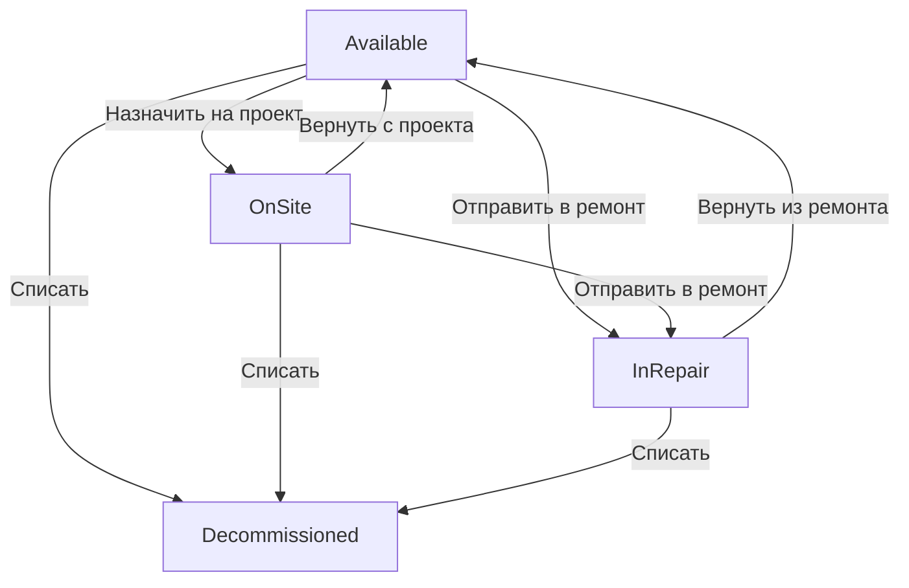

# Анализ механизмов управления состояниями в FleetManager

## 1. Архитектурная реализация

В системе FleetManager управление состояниями техники реализовано с использованием перечисления `MachineStatus` (enum class), определенного в файле [`src/models/Machine.h`](src/models/Machine.h). Этот подход обеспечивает четкую типизацию и ограниченный набор возможных состояний.

Основные компоненты архитектуры:
- **Перечисление состояний**: `MachineStatus` с четырьмя возможными значениями:
  - `Available` (Свободна)
  - `OnSite` (На объекте)
  - `InRepair` (В ремонте)
  - `Decommissioned` (Списана)

- **Методы управления состояниями**:
  - `getStatus()` - получение текущего состояния
  - `setStatus(MachineStatus status)` - установка нового состояния

- **Условные конструкции**: Логика переходов между состояниями реализована через условные операторы `if` и `switch`, что позволяет гибко управлять потоком выполнения в зависимости от текущего состояния.

## 2. Жизненный цикл состояний

### Полный список возможных состояний:
1. **Available** (Свободна) - начальное состояние для новой техники
2. **OnSite** (На объекте) - техника назначена на проект
3. **InRepair** (В ремонте) - техника требует ремонта
4. **Decommissioned** (Списана) - терминальное состояние, техника выведена из эксплуатации

### Условия вызова setStatus:

1. **Назначение на проект (Available → OnSite)**:
   - Условие: Текущее состояние `Available`
   - Инициатор: Пользователь выбирает машину и проект через диалог `AssignMachineDialog`
   - Локация: [`src/ui/MainWindow.cpp`](src/ui/MainWindow.cpp:503)

2. **Возврат с проекта (OnSite → Available)**:
   - Условие: Текущее состояние `OnSite`
   - Инициатор: Пользователь выбирает машину, находящуюся на проекте
   - Локация: [`src/ui/MainWindow.cpp`](src/ui/MainWindow.cpp:470)

3. **Отправка в ремонт (Available/OnSite → InRepair)**:
   - Условие: Текущее состояние не `Decommissioned`
   - Инициатор: Пользователь выбирает машину и действие "Отправить в ремонт"
   - Локация: [`src/ui/MainWindow.cpp`](src/ui/MainWindow.cpp:563)

4. **Возврат из ремонта (InRepair → Available)**:
   - Условие: Текущее состояние `InRepair`
   - Инициатор: Пользователь выбирает машину в ремонте и действие "Вернуть из ремонта"
   - Локация: [`src/ui/MainWindow.cpp`](src/ui/MainWindow.cpp:546)

5. **Списание техники (любое → Decommissioned)**:
   - Условие: Текущее состояние не `Decommissioned`
   - Инициатор: Пользователь выбирает машину и действие "Списать"
   - Локация: Не реализовано в текущей версии, но подразумевается

## 3. Побочные эффекты при смене статуса

### Изменения в пользовательском интерфейсе:

1. **Обновление таблицы**:
   - Изменение цвета фона ячейки статуса в зависимости от состояния
   - Обновление текста статуса в таблице
   - Локация: [`src/ui/MachineTableModel.cpp`](src/ui/MachineTableModel.cpp:86-105)

2. **Обновление панели деталей**:
   - Изменение отображаемого статуса в панели деталей
   - Локация: [`src/ui/MainWindow.cpp`](src/ui/MainWindow.cpp:621-630)

3. **Обновление строки состояния**:
   - Пересчет и отображение количества техники в каждом состоянии
   - Локация: [`src/ui/MainWindow.cpp`](src/ui/MainWindow.cpp:598)

4. **Изменение текста действий**:
   - Динамическое изменение текста кнопок в зависимости от состояния:
     - "Назначить на проект" ↔ "Вернуть с проекта"
     - "Отправить в ремонт" ↔ "Вернуть из ремонта"
   - Локация: [`src/ui/MainWindow.cpp`](src/ui/MainWindow.cpp:830-841)

5. **Изменение доступности действий**:
   - Включение/отключение кнопок в зависимости от текущего состояния
   - Локация: [`src/ui/MainWindow.cpp`](src/ui/MainWindow.cpp:772-784)

### Изменения в внутренней логике:

1. **Обновление базы данных**:
   - Все изменения состояния сохраняются в базе данных
   - Локация: [`src/database/FleetDatabase.cpp`](src/database/FleetDatabase.cpp:219-221)

2. **Сопутствующие изменения полей**:
   - При назначении на проект: установка текущего проекта и даты назначения
   - При возврате с проекта: сброс текущего проекта и даты назначения
   - Локация: [`src/ui/MainWindow.cpp`](src/ui/MainWindow.cpp:471-472, 503-504)

3. **Фильтрация данных**:
   - Обновление фильтрации таблицы при изменении состояния
   - Локация: [`src/ui/MachineTableModel.cpp`](src/ui/MachineTableModel.cpp:140-168)

## 4. Инкапсуляция и доступ

### Роль getStatus в обеспечении целостности данных:

1. **Контроль доступа**:
   - Метод `getStatus()` предоставляет доступ только для чтения к текущему состоянию
   - Это предотвращает несанкционированное изменение состояния без использования `setStatus()`

2. **Управление потоком выполнения**:
   - Используется в условных конструкциях для определения доступных действий
   - Пример: Проверка текущего состояния перед назначением на проект
   - Локация: [`src/ui/MainWindow.cpp`](src/ui/MainWindow.cpp:489)

3. **Валидация переходов**:
   - Перед изменением состояния проверяется текущее состояние через `getStatus()`
   - Это обеспечивает корректные переходы между состояниями
   - Пример: Проверка, что машина свободна перед назначением на проект

4. **Отображение состояния**:
   - Используется для отображения текущего состояния в UI
   - Пример: Отображение статуса в панели деталей
   - Локация: [`src/ui/MainWindow.cpp`](src/ui/MainWindow.cpp:622)

## 5. Диаграмма переходов между состояниями

### Описание состояний:

- **Начальное состояние**: Available (Свободна) - новая техника по умолчанию свободна
- **Промежуточные состояния**:
  - OnSite (На объекте) - техника назначена на проект
  - InRepair (В ремонте) - техника требует ремонта
- **Терминальное состояние**: Decommissioned (Списана) - техника выведена из эксплуатации

### Правила переходов:

1. Из Available можно перейти в OnSite или InRepair
2. Из OnSite можно перейти в Available или InRepair
3. Из InRepair можно перейти только в Available
4. В Decommissioned можно перейти из любого состояния
5. Из Decommissioned невозможно перейти в другие состояния

## Заключение

Система управления состояниями в FleetManager реализована с использованием простого, но эффективного подхода на основе перечислений и условных конструкций. Это обеспечивает:

- Четкую типизацию и ограниченный набор состояний
- Контролируемые переходы между состояниями
- Сопутствующие изменения в UI и базе данных
- Сохранение целостности данных через инкапсуляцию

Такая архитектура подходит для приложения средней сложности и может быть расширена при необходимости добавления новых состояний или правил переходов.